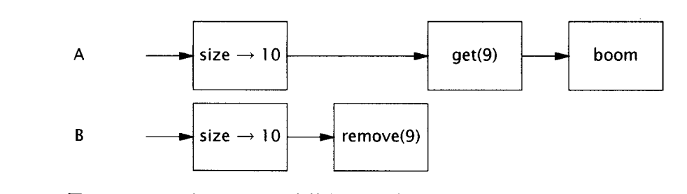
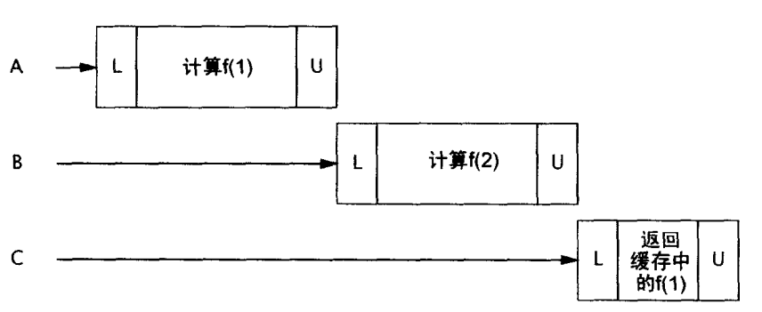
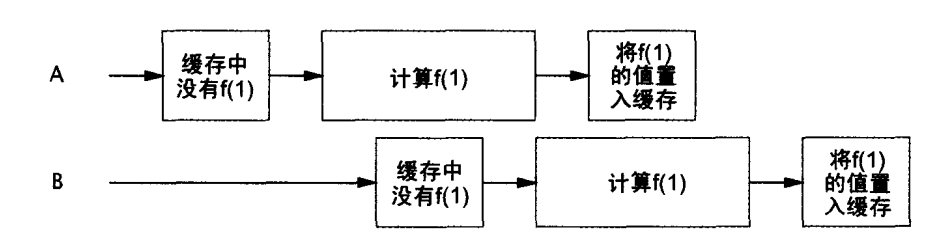
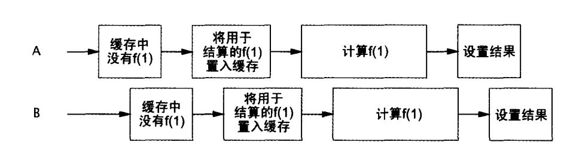

# 《JAVA并发编程实践》

## 环境

JDK1.8、Maven3.X

## 介绍

线程又能称为轻量级进程，作为现代操作系统的最小的时序调度单位。同一个进程有多个线程，它们共享该进程资源。

### 线程的优点

恰当的使用，能提高复杂应用的性能；可以把复杂难以理解的代码转化为直接简介的代码。GUI就使用线程来改善性能，同样线程被作用域JVM的垃圾回收器。

如AWT、Swing这样的现代GUI框架，用事件派发线程取代了主事件循环，如按下一个按钮，事件监听器就会去调用程序定义的事件处理器，这样子其他事件触发时就不会引起对上一个事件的长时间等待

### 线程的缺点

- 竞争资源导致了死锁
- 线程之间的频繁切换，导致了上下文切换时间太长了，掩盖了线程带带来的好处。

### 线程的场景

- 定时器

可能在定时任务执行的时候，可能有其他的线程正在访问相同的数据

- Servlets and JSP

一个servlet可能同时为多个用户提供服务，所以Servlet线程必须是安全的。同时Servlet间共享的信息（Session 、
ServletContext）都需要保证线程的安全

- 远程方法调用

诸多的远程方法调用中线程，可能会对同一个对象的同一个方法进行同时调用，也必须保证线程安全。

- Swing和AWT

为了对用户发起事件进行快速相应，后台的事件处理器执行时如果需要访问应用程序转台，就可能会遇到其他应用程序也在访问（如编辑的文件），故也需要线程的安全。

## 线程安全

本质是对共享、可变的状态的管理，状态就是对象的数据。

Java中的封装、不可变性、以及明确的不变约束有助于维护线程安全。

> 线程安全：多个线程访问同一个类，不需要指导线程如何调度与执行，不需要额外同步的情况下能保证类的行为仍然是正确的。

### 原子性

单独的不可分割的最小的操作单元，

对一个实例的变量进行更新，涉及读改写，很容易出现更新丢失——多个线程都同时读到，后续写回的时候就只更新了一次相当于。

#### 竞争条件

计算的正确性依赖于运行时相关的时序或者多线程的交替。最常见的竞争条件，检查再运行，就如同单例模式。

> 数据竞争：数据没有同步，导致读取的是别人已经更新但没有写入的数据。

UnsafeAtomTest1 虽然看似没有问题，每步都是原子操作，但其实复合之后，仍会出现竞争问题，需要保证整个update都是原子的才行。

### 锁

通过synchronized 可以消除 UnsafeAtomTest1 的问题 ，但是性能下降。

#### 内部锁

内部锁：synchronized

- 定义在方法上

`public synchronized void method()` 当method方法被调用时，调用线程必须获得当前对象的锁。

锁对象：当前对象。

- 同步代码块

synchronized(Object obj){ }

锁对象：自定义一个共同使用的锁对象。

好处：

1. 同步块可以更为精确的控制同步代码范围

2. 小的代码块非常有利于锁的快进快出，假设同步块前后代码段较为耗时，而它们又无需进行同步操作，那么，将这些代码纳入整个同步代码块就会增加锁的等待时间。

- 静态方法的同步

`public synchronized static method()`

锁对象：Class对象

#### 可重入

即获取锁之后，再次请求已经获取的锁对象锁定的资源时，仍旧是成功的。

如ReentryTest1中的代码，如果不能可重入就会导致死锁，子类调用父类的时候子类已经占用了父类的锁，这时候如果再调用就会死锁。

### 用锁来保护状态

会多个线程访问的对象上锁，只有获得锁对象的线程能使用锁。

能够一段复合操作中所涉及变量能通过一个锁进行控制。过多使用锁，可能导致活跃度和性能。

### 活跃度与性能

如果对一个Servlet声明为Synchronized，因此当同时有多个请求到达后，只能依次被处理，称为弱并发。

应该谨慎控制synchronized块的大小，把不会影响共享状态的代码移动到同步块外。

CachedFactorizer 展示一个适中的锁的粒度。

> 耗时的计算和操作，比如网络或控制台I/O，难以快速完成，不应该在执行期间，长时间占有锁。

## 共享对象

### 可见性

NoVisibility 可能输出42，可能输出0，或者无法终止，不能保证使用恰当的同步——写入ready和number的值不一定对读线程可见。

因为重排序机制的存在——在某线程中，如果重排序不影响结果就不能保证其中的操作一定是按照程序写定的顺序执行。

#### 过期数据

即读线程读取到的数据，可能是已被更新但还没更新到磁盘的数据。

#### 非原子的64位操作

> 最低限的安全性：数据是真实的数据，但不一定是最新。

没有声明为volatile的64位数据（double、long），不能保证最低限的安全性：JVM允许将64位的读和写划分为两个32位的操作，如果读和写发生在不同的线程，就可能读取到一个值的高32位，另一个值的低32
位。即使不关心数据是不是最新的，long、和double都是不安全的。注意这里要在32位多CPU的机器上运行Date64Test才能看到结果。

#### 锁和可见性

A ---> B 两个进程顺序的对对象加锁，那么A对象持有锁期间的对象的任何改变，在B持有对象锁的时候都是可见的。

> 为了保证可见性，对于共享的数据使用公共的锁进行同步是有必要的。

#### Volatile变量

同步的弱形式，可以让数据在更新后告知其他线程。声明为volatile类型的域，编译器在运行时会监视这个变量：共享且不会被重排序。在访问volatile变量的操作不会加锁，不会引起执行线程的阻塞，使得volatile
变量相对于synchronized，是轻量级的同步机制。但是依赖volatile变量会使得使用锁的代码更脆弱，难以理解。

> 当volatile变量能够简化实现和同步策略的验证时，才使用它们。一般用于确保它们所引用的对象状态的可见性，或者用于表示重要的生命周期事件的发生。

`- server`命令行选项——server模式的jVM比Client模式的JVM执行更多的优化，会把没有在循环体中修改的变量提升到循环体外部。所以开发环境中（client模式的JVM）可以工作的代码在部署（server模式的JVM
）环境中可能会失败。

volatile不足以使得自增操作原子化！！！

> 加锁可以保证可见和原子性，volatile只能保证可见性

满足以下条件可以使用volatile：

- 写入变量时不依赖变量的当前值
- 变量不需要其他状态变量共同参与
- 访问变量，不需要锁

### 发布和溢出

- 发布
  发布一个对象，就是让其能够其他的代码进行使用。
- 溢出
  对象还未准备好就把它进行发布

最常见的发布方式就是将对象的方存储到公共静态域中，任何类和线程都能看见这个域，在这个过程中就可能发生逃逸——所有该发布的对象中所能获取的数据都变成公有了。

#### 安全构建的实践

ThisEscape 就让this引用在构造期间溢出，新启的线程能够直接共享this引用，导致未完成构建的对象被使用，可以通过延迟线程的启动，使得对象完成构造之后再启动，一次解决问题。
同时构造函数中包含了对可重写方法的引用，导致了this引用溢出，可以把方法变成private或者final来解决该问题。

### 线程封闭

不共享数据，使得对象封闭在一个线程中。

- Swing把所有的非安全的数据限制在事件分发线程中，不同事件线程的其他线程不应该访问这些对象的，实现线程安全。通过invokeLater来安排事件线程如何执行Runable实例。
- JDBC并没有要求Connection是线程安全的，总是从连接池获取一个Connection对象，进行请求处理。每个线程都是同步地处理大多数请求（如Servlet或者Enterprise
  Java
  Bean调用），在这些请求在处理的过程中，不会把Connection对象分配给其他线程——相当于把连接对象限制在了使用它得的线程中，

#### Ad-hoc线程限制

Ad-hoc线程封闭是指，维护线程封闭性的职责完全有程序实现来承担。例如可见性修饰符或局部变量，能将对象封闭到目标线程上。事实上对于线程封闭对象通常保存在共有变量中。Ad-hoc线程封闭是非常脆弱的，所以程序中尽量少使用它，可以使用以下两种技术（栈封闭，ThreadLocal）。

如Volatile变量的单线程使用，是的volatile的”读-改-写“操作是安全的，同时这种情况下，该变量的修改，其他线程又能立即获取到。

#### 栈限制

只能通过本地变量才可以触及对象，本地变量本身就被封装在执行线程中，存在于执行线程栈。也称线程内部或者线程本地用法，不应该与核心库类的ThreadLocal混淆。相比于ad-hoc更加容易维护且健壮。

StackLockTest 展示了栈限制

#### ThreadLocal

将每个线程与持有的数据对象关联在一起。提供了get与set访问器。总是get到当前执行线程set的最新值。

ThreadLocal通常用于防止对可变对像的实例变量或全局变量进行共享。如果多个线程共享一个Jdbc
Connection很容易导致线程不安全，因为获得该连接的线程可能会进行connection的修改。

ThreadLocalTest展示了ThreadLocal保证每个线程拥有自己的JDBC connection的方法。这样子做肯定是不合适的，因为这样子并发很大就会OOM。

J2EE容器把一个事务上下文和一个可执行线程关联起来。框架代码只需要知道当前是哪个事务，就能从ThreadLocal获取事务上下文，省却了每个方法传递上下文信息的需要，但是增加了框架家的耦合。

### 不可变性

常量在构造函数中创建之后就不再改变，默认就是线程安全的。

- 不可变对象
    - 所有状态创建之后不能再修改
    - 所有域都是final
    - 被正确创建且没有this引用的溢出。

#### final域

final不能修改，但是对于final域指向的对象仍然是可变的。

> 尽量是私有、不可变

#### 使用volatile发布不可变对象

ImmutableTest 中的cache对象通过返回数据对象的拷贝，从而使得缓存内部的对象不能被其他线程修改；通过volatile设置cache的类型，使得一旦新的缓存出现，其他线程立即可见。

### 安全发布

发布数据，其他线程能够共享。即同步对象初始化，保证创建后的对象可见性。

#### 不正确发布：当好对象变坏时

可能会导致对象的最新状态不可见或者对象的最新引用的不可见。

UnsafePublicTest 展示了没使用同步来确保Holder对其他线程可见，称为非正确发布，可能引起的两种错误：

- 其他线程获取到的旧的Holder引用
- 其他线程获取了最新的Holder引用，但是状态非最新。

#### 不可变对象与初始化安全性

不可变对象中含有其他的对象的引用还是需要同步来保证安全发布。

#### 安全发布的模式

- 通过静态初始化器来初始化对象的引用（静态初始化器是由JVM在类的初始化阶段执行，即在类被加载后并且被线程使用前。在静态初始化期间，内存写入操作将自动对所有线程可见）
- 将引用存储到volatile或者AtomicReference中
- 将引用存储到final域中
- 用锁保护存储的域

#### 高效不可变对象（Effectively immutable objects）

对象可变，但是状态发布后不能被修改称为有效不可变；

> 任何线程可以在没有额外的同步下安全地使用一个安全发布的高效不可变对象、

#### 可变对象

对象可变，那么安全发布只能保证发布当时的状态可见性，状态修改时仍需要同步保证可见性。

> 发布对象：
> - 不可变对象可以任意机制发布
> - 高效不可变对象（对象可变，状态不可变）必须要安全发布
> - 可变对象必须要安全发布，同时必须要线程安全或者被锁保护。

## 组合对象

### 设计线程安全的类

#### 收集同步需求

就是把所有在状态变换过程中设计的对象收集起来，查找其中需要额外同步的地方。检查不变约束和后验条件。

### 实例限制

通过线程限制（单一线程访问）、或者所有的访问都能正确地上锁。

实例限制：简化了线程安全化工作，能够更简单地分析某个对象的所有访问路径。

通过限制以及锁就能更好的使用共享数据了。

> 数据封装在对象内部，把对数据的访问限制在对象的方法上，更易并发访问数据，获得正确的锁。

#### Java监视器模式

线程限制原则的直接推论之一。封装了所有的可变状态，由对象自己的内部所保护。如Vector和Hashtable都使用了该模式。效率低下

私有锁相较于对象锁的粒度更小，更好的并发，

详见 VehicleTracker1 其中代码

### 委托线程安全

把线程安全的类组装起来，把他们作为组装之后类的状态。即把当前类的状态委托给线程安全的内部组成类进行线程安全的职责。

详见 DelegatingSafeTest 其中代码

#### 非状态依赖变量

VisualComponent 展示了组合对象的不变约束与组件的状态变量无关

#### 当委任无法胜任时

组合对象中组件可能是单独的线程安全的，但是为了满足组合对象的不变性约束，光保证组件各自的线程安全是不够的，需要把所有涉及的状态都上锁。

NumberRangeTest 展示了两个线程安全的组件，但是由于volatile无法保证原子性，导致非线程安全的类。

### 向已有的线程安全类添加功能

方式：

- 修改原始类，以支持期望的操作，但是可能无法访问源代码或者修改的自由。
- 扩展这个类，并非所有的类都给子类暴露了足够多的状态，同时扩展之后，多个子类分布到了多个独立维护的源代码文件中，难以维护。一旦低层的类选择了不同的锁来保护状态变量就会把子类的同步策略破坏掉。BetterVector
  因为Vector的同步策略规约的原因不会出现该问题。

#### 客户端加锁

ListHelper 展示了 扩展类的时候 错误加锁会产生的问题。

#### 组合

详见 ImprovedList ,简单装饰了List之后，实现了自定义的putIfAbsent功能。通过额外的synchronized实现了所有功能的同步。

### 同步策略的文档化

为同步编写文档，可以减少后期维护时候的安全性的威胁。在设计阶段就编写同步策略的文档。何时请求锁、释放锁、锁干嘛了都需要记录。

## 构建块

### 同步容器

同步容器类包括两部分：一个是Vector和Hashtable；另一个是痛惜容器，同步包装类Collections.synchronizedXXXX工厂方法创建。通过封装状态，对公共方法进行同步实现线程安全。

#### 同步容器中出现的问题

复合操作如果存在多线程并发修改的时候就容易出现错误

如Vector中线程A请求获取最后一个元素，而这时候线程V请求删除最后一个元素

```java
public static Object getLast(Vector list){
        int lastIndex=list.size()-1;
        return list.get(lastIndex);
        }

public static void deleteLast(Vector list){
        int lastIndex=list.size()-1;
        list.remove(lastIndex);
        }

```

如果线程按照如下方式执行，就可能导致出现ArrayIndexOutOfBoundsException


由于允许客户端加锁的同步，所以可以对同步容器类list上锁，使得两个操作变为原子操作即可。当然这是减少了并发性了。

#### 迭代器和 ConcurrentModificationException

对Collections进行迭代的标准方式是使用Iterator，在并发修改的时候——迭代后被修改，会抛出未检查的ConcurrentModificationException。

ConcurrentModificationException专门用来捕获并发的错误，在迭代期间计数器被修改，hasNext或next就会抛出该异常。

如果对迭代加锁很容易出现死锁、饥饿，极大影响吞吐量。容器复制可能解决问题，但是性能差。

#### 隐藏迭代器

共享的容器类在toString的时候隐藏着对容器元素的迭代，如果没有上锁就容易出现 ConcurrentModificationException

详情见HiddenIterator

### 并发容器

提高了曾经的同步容器的吞吐量，并发性有所提升。

ConcurrentHashMap代替同步的哈希Map；当多数操作为读取时，CopyOnWriteArrayList是List的同步实现。

Queue相较于List有着更高的并发实现。 FIFO队列：ConcurrentLinkedQueue； 非并发的有顺序的队列：PriorityQueue；

BlockingQueue扩展了Queue，增加了可阻塞的插入和获取。如果队列是空的，就一直阻塞直到队列中存在可用元素；如果队列是满的，插入操作会一直阻塞直到队列有可用空间。

ConcurrentSkipListMap、ConcurrentSkipListSet作为同步的SortedMap和SortedSet的并发替代品。

#### ConcurrentHashMap

使用更加细化的锁机制：分离锁，实现更深层次的共享访问。任意数量的读线程可以并发访问，读者和写着也可以并发访问，并且有限数量的写线程还可以并发修改。提供的是弱一致性的迭代器，不会抛出ConcurrentModificationException。允许并发修改，不会感应到迭代器创建之后对容器的修改。

#### CopyOnWriteArrayList

是同步List的一个并发替代品，避免了迭代期间对容器加锁和复制。每次返回的都是当时底层数据状态的拷贝，之后的修改并不会影响已经返回的数据。读多写少的时候使用，否则每次改变容器就复制数组开销可能过多了。

1. CopyOnWrite适用于读多写少的情况，最大程度的提高读的效率；
2. CopyOnWrite是最终一致性，在写的过程中，原有的读的数据是不会发生更新的，只有新的读才能读到最新数据；
3. 如何使其他线程能够及时读到新的数据，需要使用volatile变量；
4. 写的时候不能并发写，需要对写操作进行加锁；

如事件通知系统：递交一个通知需要迭代已经注册的监听器，并且调用其中每一个。注册和注销事件监听器就少的多的情况。

### 阻塞队列和生产者-消费者模式

阻塞队列提供了可阻塞的put和take，与定时的offer和poll等价。支持生产者-消费者模式，该模式不需要把任务立即处理，而是存入到一个to
do清单，这样消费者和生产者就相当于解耦了，可以以不同的速度进行生产和消费，简化了工作负荷的管理。

生产者-消费者设计围绕阻塞队列展开，生产者把数据放入队列，不需要知道消费者是谁；消费者从队列中取出数据，不需要知道生产者是谁。如线程池和工作队列进行结合。

BlockingQueue：

- LinkedBlockingQueue、ArrayBlockingQueue都死FIFO队列，拥有比同步List更好的并发性能。
- PriorityBlockingQueue是排序后的阻塞队列。
- SynchronousQueue
  非真正的队列，不会为队列元素维护任何存储空概念。而是维护一个排队的线程清单。平常都是需要先入任务队列，之后取出来使用。而该队列直接进行任务的移交，减少了生产者和消费者之间移动数据的延迟。直接移交给生产者更多的反馈信息，就好像文件直接给了同事，而不是把文件发送到邮箱，等待同事取文件。由于没有存储能力，所以除非有线程能够执行任务，否则就会put和take一直阻塞。只有在消费者充足的时候适合使用。

#### 生产者消费者实例：桌面搜索（扫描本地驱动器并归档文件）

详见ch05.demo01

#### 连续的线程限制

充分的内部同步，使得对象能够从生产者安全的发布至消费者线程的过程中，有着连续的线程限制，不会出现争抢。一旦发布（对象被转移），也只能有唯一一个线程能够访问这个对象的权限，被其独占；归还之后又重归线程池独占。通过阻塞队列简化了这项工作。

#### 双端队列和窃取工作

Deque和BlockingDeque，分别扩展了Queue和BlockingQueue。通过ArrayDeque和LinkedBlockingDeque。双端队列适用于窃取工作。

窃取工作：线程在完成了自己队列的所有任务之后，能够取偷取其他消费者的双端队列中末尾的任务。

### Synchronizer

是一个对象，根据本身的状态调节线程的控制流。阻塞队列可以扮演Synchronizer角色。还有其他类型的Synchronizer：信号量（semaphore）、关卡（barrier）、闭锁（latch）

结构特性：封装状态，这些状态决定线程执行到某一个点时时通过还是被迫等待；提供操控状态的方法，高效等待Synchronizer进入期望状态。

#### 闭锁

是一种Synchronizer，可以延迟线程进度直到线程终止状态。一旦闭锁到达了终点状态，就不能再改变状态，允许所有线程都通过。

如以下场景：

- 一个计算不执行，直到它所需要的资源被初始化。一个二元闭锁（两个状态）可以用来表达“资源R已经被初始化”，并且所有需要用到R的活动都已经在闭锁中等待。
- 确保服务不会开始，直到它依赖的所有服务都已经开始。每个服务都包含一个二元闭锁，
- 等待，直到活动的所有部分都已经为继续处理做好了充分准备。比如所有玩家都准备，才能开启副本。

CountDownLatch是一个灵活的闭锁实现。用于：允许一个或者多个线程等待一个事件集的发生。闭锁的状态包括一个计数器，初始化是一个证书，表现为需要等待的事件数。countDown对计数器做减操，表示一个事件已经发生。await
表示等待计数器达到0。

详情见 TestHarness 通过闭锁模拟了瞬时并发，并对其进行计时

#### FutureTask

另一种闭锁。抽象的可携带结果的计算。等价于可携带结果的Runnable。一旦完成就会永远停止在这个状态。

Future.get会阻塞直到有结果返回。Executor利用FutureTask来完成异步任务，并且可以进行任何潜在的耗时计算

详情见Preloader

#### 信号量

计数信号量可以用来实现资源池或者给定容器的边界。semaphore跟操作系统中一致。没有可用的资源，阻塞acquire，直到release方法返回了一个许可。

用信号量约束容器：详情见BoundedHashSet

#### 关卡

类似于闭锁，能够阻塞一组线程，直到某些事件发生。闭锁要求所有的等待事件发生，而关卡要求所有线程到达。好似家庭聚会，所有人到达再决定之后的事情。

CyclicBarrier允许一个给定数量的成员多次集中在一个关卡点，常用于并行迭代算法。把问题拆分成相互独立的子问题，当线程到达关卡，就会await进行阻塞，直到所有线程都到达。关卡放行之后会再次重置状态，可以重复使用。

常用在把一个大任务拆分成多个独立的任务，之后当所有的独立任务都已经完成，关卡才会放行。

### 为计算结果建立高效、可伸缩的高效缓存

减少等待事件、提高吞吐量，代价是占用更多的内存。

详情见ch05.demo02，

Memoizer1 为了能够保证HashMap的同步，所以对缓存操作上了锁，导致对整个Memoizer实例上了锁，并发性相当弱。


Memoizer2 通过ConcurrentHashMap来提升性能


Memoizer3 通过Future来缓存计算任务，但是因为compute是个符合操作，但是未保证原子性，所以会出现创建的任务，但是却在计算相同的值。同时可能会出现缓存污染，因为可能计算失败也被缓存了，导致之后一致获取的是失败的。


Memoizer 通过ConcurrentHashMap的putIfAbsent解决了 计算相同值，同时在出现计算失败的时候，会消除该失败的缓存。


## 附录

### 锁类型

1. 类锁：在代码中的方法上加了static和synchronized的锁，或者synchronized(xxx.class）的代码段，如下文中的increament()；

2. 对象锁：在代码中的方法上加了synchronized的锁，或者synchronized(this）的代码段，如下文中的synOnMethod()和synInMethod()；

3. 私有锁：在类内部声明一个私有属性如private Object lock，在需要加锁的代码段synchronized(
   lock），如下文中的synMethodWithObj()。


### 并发规则

- 可变状态越少，保证线程安全越容易
- 尽量域声明为final
- 不可变对象天生就是线程安全的，可以自由共享。
- 封装使得管理复杂度变得可行，可以更好的分析所有的路径。
- 用锁守护所有可变变量
- 同一不变约束中所涉及的变量使用相同锁
- 文档化同步策略
